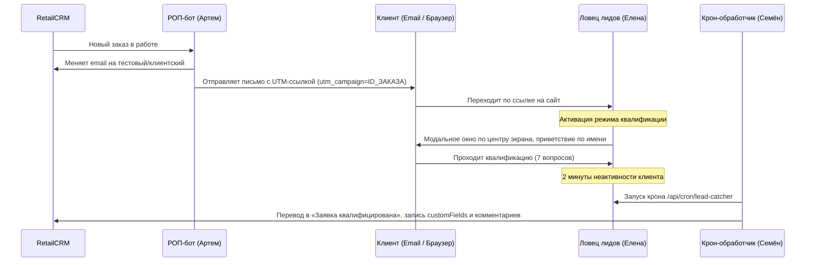

# Интеграция квалификации клиентов: РОП-бот (Артем) и Ловец лидов (Елена)

## 🕵️‍♂️ Суть механизма

Этот механизм автоматизирует квалификацию B2B-клиентов на этапе новых заявок, убирая рутинные звонки менеджеров. Интеграция связывает исходящую рассылку РОП-бота с ИИ-консультантом Еленой на сайте.

### Схема взаимодействия

---

## 🛠️ Детали реализации

### 1. Переход и инициализация (Widget Embed)
При переходе по ссылке вида `https://www.zmktlt.ru/?utm_source=rop_bot&utm_medium=email&utm_campaign=53770` виджет на фронтенде считывает `utm_campaign` (ID заказа) и переходит в **Режим квалификации**:
* **Центрированный дизайн:** Виджет отображается в центре экрана как модальное окно (`.okk-qualification-modal`, размеры `600px` на `650px`), а фон страницы затемняется и размывается.
* **Мгновенный запуск:** Сообщение-приветствие отправляется мгновенно без пауз и разбивок на предложения.
* **Отключение стандартных лид-магнитов:** Скрываются/отключаются формы захвата контактов (телефон/email), exit-intent (окно при уходе с сайта) и кнопки быстрых ответов, чтобы клиент фокусировался только на вопросах квалификации.

### 2. Логика общения Елены (Widget Chat)
В режиме квалификации системный промпт Елены (`SYSTEM_PROMPT_TEMPLATE`) переключается на строгие B2B-правила:
* **Уважительное обращение по имени:** Обращение строго на «Вы» (с большой буквы) и только по первому имени (например, *«Здравствуйте, Тимофей!»* вместо *«Тимофей Новиков»*).
* **Сбор имени при его отсутствии:** Если имя клиента не передано из CRM, Елена первым делом спрашивает: *«Подскажите, пожалуйста, как я могу к Вам обращаться?»*. Имя записывается в CRM.
* **Мягкий тон без «допроса»:** Перед каждым вопросом бот объясняет клиенту, *зачем* нужна эта информация технологу (например, *«ИНН компании необходим для подготовки официального КП»*, *«Срок установки важен, чтобы спланировать график производства»*).
* **Запрет на дублирование:** Запрещено отправлять один и тот же вопрос в одной формулировке, если клиент не ответил или переспросил. Елена обязана перефразировать вопрос.
* **Запрет на продажу/доставку:** Бот не имеет права обсуждать стоимость печей и доставки до просчета технологом.

### 3. Вопросы квалификации
Елена последовательно закрывает 7 вопросов:
1. Желаемый срок установки оборудования на объекте.
2. Ориентировочный бюджет.
3. Что принципиально важно при выборе (цена, надежность, сроки).
4. ИНН компании (если неизвестно название).
5. Наличие готового ТЗ (если нет — бот предлагает составить с технологом).
6. С кем сравнивают предложение (конкуренты).
7. Форма закупки (прямой договор, внутренний тендер или гос. закупка 44-ФЗ/223-ФЗ).

### 4. Крон-обработчик и Семён-аналитик (Lead Catcher Cron)
Раз в минуту запускается крон `/api/cron/lead-catcher`:
* **Условия выборки:** Обрабатываются сессии, где `is_lead_created = false` И (`has_contacts = true` ИЛИ `utm_campaign IS NOT NULL`).
* **Контроль завершения диалога:** Сессия обрабатывается только после **2 минут неактивности** клиента (для симуляционных тестов с `visitor_id`, начинающимся на `v_lc_sim_`, эта задержка отключается).
* **Анализ Семёна:** Семён (OpenAI GPT-4o-mini) анализирует лог чата и извлекает ответы.
* **Обновление заказа в RetailCRM:**
  * Статус заказа меняется на **«Заявка квалифицирована»** (`zapros-kontaktov`).
  * Добавляется подробный комментарий менеджера со всеми 7 ответами.
  * Заполняются customFields заказа:
    * `kogda_vam_nuzhno_chtoby_oborudovanie_uzhe_stoyalo` ➔ Срок установки.
    * `expected_amount` / `ozhidaemaya_summa` ➔ Бюджет.
    * `typ_customer_margin` ➔ Тип закупки (автоматический маппинг по словарю `type_customer`, например, `dlya-sebya-pryamaya-zakupka-vnutrennij-tender` или `tender`).
    * `firstName` клиента (если оно было собрано в чате взамен пустого).
