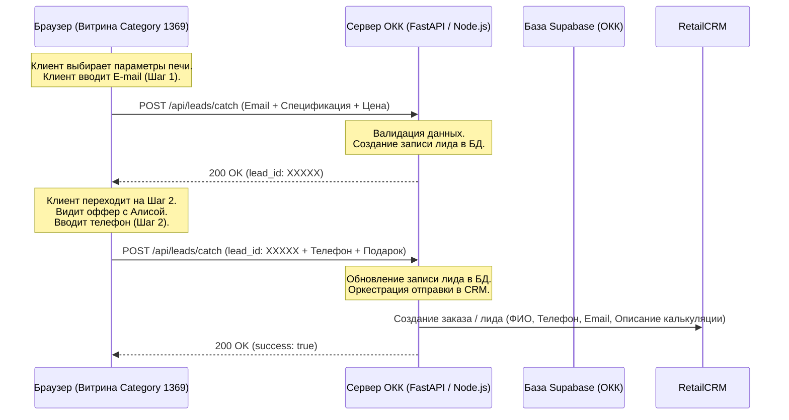

# Интеграционный пакет: Интерактивный калькулятор-квиз СНОЛЕКС
> **Для интеграции в систему «Ловец Лидов» (Проект ОКК)**
> 
> Этот документ содержит полностью готовый к переносу фронтенд-код интерактивного калькулятора-квиза, описание формата обмена данными (JSON Payload) и пошаговые инструкции для разработчиков проекта ОКК по приёму заявок и отправке их в RetailCRM.

---

## 1. Схема взаимодействия систем (Data Flow)



---

## 2. Спецификация API-запросов (Payloads)

Фронтенд делает два последовательных AJAX-запроса методом `POST` на ваш API-эндпоинт (например, `/api/leads/catch`). Разработчикам ОКК нужно реализовать обработку этих двух сценариев.

### Шаг 1: Первичная регистрация (E-mail + Параметры)
**Назначение:** Закрепить за клиентом базовую конфигурацию и Email, даже если он закроет вкладку на шаге с телефоном.

* **Тип запроса:** `POST`
* **Content-Type:** `application/json`
* **Тело запроса (JSON):**
```json
{
  "email": "example@company.ru",
  "price": 166725,
  "specs": {
    "category_id": 1369,
    "category_name": "Лабораторные муфельные печи СНОЛЕКС",
    "volume": "20",
    "temp": "1250",
    "phase": "220"
  }
}
```
* **Ожидаемый ответ сервера:**
```json
{
  "success": true,
  "lead_id": "40bca710-d9d8-494b-9720-313bf9f43c5b" 
}
```
*(Идентификатор `lead_id` может быть UUID или числовым ID из таблицы лидов ОКК. Он возвращается фронтенду, чтобы связать второй шаг со вторым запросом).*

---

### Шаг 2: Дообогащение контакта (Телефон + Подарок)
**Назначение:** Закрепление телефона и бонуса (Яндекс Станция Алиса), отправка готового лида в RetailCRM.

* **Тип запроса:** `POST`
* **Content-Type:** `application/json`
* **Тело запроса (JSON):**
```json
{
  "lead_id": "40bca710-d9d8-494b-9720-313bf9f43c5b",
  "phone": "+7 (999) 123-45-67",
  "gift": "Яндекс Станция Алиса Мини",
  "price": 166725,
  "specs": {
    "category_id": 1369,
    "category_name": "Лабораторные муфельные печи СНОЛЕКС",
    "volume": "20",
    "temp": "1250",
    "phase": "220"
  }
}
```
* **Ожидаемый ответ сервера:**
```json
{
  "success": true
}
```

---

## 3. Как мапить поля в RetailCRM (Инструкция разработчикам ОКК)

При получении данных Шага 2 (или при таймауте Шага 1, если клиент не оставил телефон в течение 10 минут), бэкенд ОКК должен сформировать заказ/заявку в RetailCRM. 

### Рекомендуемый маппинг полей в RetailCRM API:
1. **Тип заказа / Способ оформления:** Оформить как `order[orderMethod] = "quiz-calculator"` или `calculator`.
2. **Контактные данные:** 
   * `order[email]` = `payload.email`
   * `order[phone]` = `payload.phone`
3. **Комментарий менеджера (или состав заказа):**
   Рекомендуется сформировать понятное текстовое ТЗ для менеджера в поле `order[customerComment]` или `order[managerComment]`:
   > **Заявка с интерактивного калькулятора СНОЛЕКС (Категория 1369)**
   > 
   > **Выбранная конфигурация:**
   > * Объем камеры: {specs.volume} л
   > * Температура: {specs.temp} °C
   > * Электросеть: {specs.phase} В
   > 
   > **Подобранная цена на сайте:** {price} руб. (с учетом НДС)
   > 
   > **Зафиксированный подарок:** {gift}
   > **Обещанный бонус:** Бесплатная онлайн-настройка и запуск оборудования на бланке КБ завода.
4. **Теги:** Добавить теги `Калькулятор`, `СНОЛЕКС`, `Ловец_Лидов_ОКК` для сквозной аналитики.

---

## 4. Готовый фронтенд-код калькулятора (HTML + CSS + JS)

Код полностью самодостаточен, написан на чистом Vanilla JS и чистом CSS. В нем нет зависимости от внешних библиотек (кроме стандартных системных шрифтов), что гарантирует отсутствие конфликтов с Webasyst Smarty или jQuery на витрине.

> [!WARNING]
> **Важное требование по контенту:** Согласно регламенту маркетинга, в тексте **строго запрещено упоминание процентов (например, НДС 20%)**. Используйте только формулировку **«с учетом НДС»** или **«с НДС»**.

### Код для вставки на сайт (или в шаблон категории):

```html
<!-- ИНТЕРАКТИВНЫЙ КАЛЬКУЛЯТОР СНОЛЕКС -->
<div class="zmk-compact-selector" id="zmk-configurator-1369">
  <style>
    .zmk-compact-selector {
      background: radial-gradient(circle at top left, #2e2f34, #1a1b1e);
      border: 1px solid rgba(255, 255, 255, 0.08);
      border-radius: 12px;
      padding: 24px;
      margin: 20px 0 30px;
      box-shadow: 0 10px 30px rgba(0, 0, 0, 0.25);
      color: #ffffff;
      font-family: 'Inter', -apple-system, BlinkMacSystemFont, "Segoe UI", Roboto, sans-serif;
    }
    .zmk-selector-header {
      margin-bottom: 20px;
      border-bottom: 1px solid rgba(255, 255, 255, 0.06);
      padding-bottom: 12px;
    }
    .zmk-selector-header h3 {
      font-size: 1.25rem;
      font-weight: 700;
      color: #ffffff;
      margin: 0 0 4px 0;
      letter-spacing: -0.02em;
    }
    .zmk-selector-header p {
      font-size: 0.88rem;
      color: #a0a5b1;
      margin: 0;
    }
    .zmk-selector-grid {
      display: grid;
      grid-template-columns: repeat(3, 1fr);
      gap: 20px;
      margin-bottom: 24px;
    }
    @media (max-width: 768px) {
      .zmk-selector-grid {
        grid-template-columns: 1fr;
        gap: 16px;
      }
    }
    .zmk-selector-col {
      display: flex;
      flex-direction: column;
      gap: 8px;
    }
    .zmk-label {
      font-size: 0.82rem;
      font-weight: 600;
      text-transform: uppercase;
      letter-spacing: 0.05em;
      color: #e85f4c;
    }
    .zmk-btn-group {
      display: flex;
      flex-wrap: wrap;
      gap: 8px;
    }
    .zmk-btn {
      flex: 1;
      min-width: 70px;
      background: rgba(255, 255, 255, 0.03);
      border: 1px solid rgba(255, 255, 255, 0.12);
      border-radius: 6px;
      padding: 10px 14px;
      color: #e2e4e9;
      font-size: 0.9rem;
      font-weight: 500;
      cursor: pointer;
      transition: all 0.2s cubic-bezier(0.4, 0, 0.2, 1);
      text-align: center;
      user-select: none;
    }
    .zmk-btn:hover {
      background: rgba(255, 255, 255, 0.08);
      border-color: rgba(255, 255, 255, 0.25);
      color: #ffffff;
    }
    .zmk-btn.active {
      background: #d44b38;
      border-color: #d44b38;
      color: #ffffff;
      box-shadow: 0 4px 12px rgba(212, 75, 56, 0.35);
      font-weight: 600;
    }
    
    /* Секция цены */
    .zmk-price-section {
      background: rgba(255, 255, 255, 0.02);
      border: 1px solid rgba(255, 255, 255, 0.05);
      border-radius: 10px;
      padding: 16px;
      text-align: center;
      margin-bottom: 24px;
    }
    .zmk-price-label {
      font-size: 0.85rem;
      color: #a0a5b1;
      text-transform: uppercase;
      letter-spacing: 0.03em;
      margin-bottom: 4px;
    }
    .zmk-price-value {
      font-size: 2.2rem;
      font-weight: 800;
      color: #e85f4c;
      text-shadow: 0 2px 10px rgba(232, 95, 76, 0.2);
      margin-bottom: 4px;
      transition: all 0.3s ease;
    }
    .zmk-price-sub {
      font-size: 0.78rem;
      color: #727681;
    }
    
    /* Форма захвата лидов */
    .zmk-form-container {
      border-top: 1px solid rgba(255, 255, 255, 0.06);
      padding-top: 20px;
    }
    .zmk-form-title {
      font-size: 0.95rem;
      font-weight: 600;
      color: #e2e4e9;
      margin-bottom: 12px;
      line-height: 1.4;
    }
    .zmk-input-row {
      display: flex;
      gap: 12px;
    }
    @media (max-width: 600px) {
      .zmk-input-row {
        flex-direction: column;
      }
    }
    .zmk-input-control {
      flex: 1;
      background: rgba(0, 0, 0, 0.2);
      border: 1px solid rgba(255, 255, 255, 0.1);
      border-radius: 8px;
      padding: 12px 16px;
      color: #ffffff;
      font-size: 0.95rem;
      font-family: inherit;
      outline: none;
      transition: all 0.25s ease;
    }
    .zmk-input-control:focus {
      border-color: #e85f4c;
      box-shadow: 0 0 0 3px rgba(232, 95, 76, 0.15);
      background: rgba(0, 0, 0, 0.35);
    }
    .zmk-input-control::placeholder {
      color: #5b5f67;
    }
    
    .zmk-submit-btn {
      display: inline-flex;
      align-items: center;
      justify-content: center;
      background: linear-gradient(135deg, #e85f4c, #d44b38);
      border: none;
      border-radius: 8px;
      padding: 12px 24px;
      color: #ffffff !important;
      font-size: 0.95rem;
      font-weight: 700;
      cursor: pointer;
      transition: all 0.25s ease;
      box-shadow: 0 4px 15px rgba(212, 75, 56, 0.3);
      white-space: nowrap;
    }
    .zmk-submit-btn:hover:not(:disabled) {
      background: linear-gradient(135deg, #f07463, #e85f4c);
      transform: translateY(-1px);
      box-shadow: 0 6px 20px rgba(212, 75, 56, 0.45);
    }
    .zmk-submit-btn:disabled {
      opacity: 0.6;
      cursor: not-allowed;
    }
    
    /* Фиолетовая кнопка для Алисы */
    .zmk-gift-btn {
      display: inline-flex;
      align-items: center;
      justify-content: center;
      background: linear-gradient(135deg, #8b5cf6, #ec4899);
      border: none;
      border-radius: 8px;
      padding: 12px 24px;
      color: #ffffff !important;
      font-size: 0.95rem;
      font-weight: 700;
      cursor: pointer;
      transition: all 0.25s ease;
      box-shadow: 0 4px 15px rgba(139, 92, 246, 0.3);
      white-space: nowrap;
    }
    .zmk-gift-btn:hover:not(:disabled) {
      background: linear-gradient(135deg, #9d71f9, #f472b6);
      transform: translateY(-1px);
      box-shadow: 0 6px 20px rgba(139, 92, 246, 0.45);
    }
    .zmk-gift-btn:disabled {
      opacity: 0.6;
      cursor: not-allowed;
    }
    
    .zmk-error-msg {
      color: #f87171;
      font-size: 0.85rem;
      margin-top: 6px;
    }
    .zmk-step2-success {
      color: #4ade80;
      font-size: 0.9rem;
      font-weight: 600;
      border-left: 3px solid #22c55e;
      padding-left: 10px;
      margin-bottom: 16px;
    }
    
    .zmk-success-state {
      text-align: center;
      padding: 15px 0;
    }
    .zmk-success-state h4 {
      color: #4ade80;
      font-size: 1.2rem;
      font-weight: 700;
      margin: 0 0 8px 0;
    }
    .zmk-success-state p {
      color: #a0a5b1;
      font-size: 0.9rem;
      margin: 0;
      line-height: 1.5;
    }
  </style>

  <div class="zmk-selector-header">
    <h3>Интерактивный конфигуратор СНОЛЕКС</h3>
    <p>Выберите требуемые параметры печи для мгновенного онлайн-расчета стоимости</p>
  </div>
  
  <div class="zmk-selector-grid">
    <!-- Температура -->
    <div class="zmk-selector-col">
      <span class="zmk-label">Температура нагрева</span>
      <div class="zmk-btn-group" id="zmk-temp-group">
        <div class="zmk-btn active" onclick="zmkSelectOption(this, 'temp', '1100')">1100 °C</div>
        <div class="zmk-btn" onclick="zmkSelectOption(this, 'temp', '1250')">1250 °C</div>
        <div class="zmk-btn" onclick="zmkSelectOption(this, 'temp', '1350')">1350 °C</div>
      </div>
    </div>

    <!-- Объем -->
    <div class="zmk-selector-col">
      <span class="zmk-label">Объем камеры</span>
      <div class="zmk-btn-group" id="zmk-vol-group">
        <div class="zmk-btn active" onclick="zmkSelectOption(this, 'vol', '10')">10 л</div>
        <div class="zmk-btn" onclick="zmkSelectOption(this, 'vol', '20')">20 л</div>
        <div class="zmk-btn" onclick="zmkSelectOption(this, 'vol', '50')">50 л</div>
        <div class="zmk-btn" onclick="zmkSelectOption(this, 'vol', '100')">100 л</div>
      </div>
    </div>

    <!-- Сеть -->
    <div class="zmk-selector-col">
      <span class="zmk-label">Электропитание</span>
      <div class="zmk-btn-group" id="zmk-phase-group">
        <div class="zmk-btn active" onclick="zmkSelectOption(this, 'phase', '220')">220 В</div>
        <div class="zmk-btn" onclick="zmkSelectOption(this, 'phase', '380')">380 В</div>
      </div>
    </div>
  </div>

  <!-- Price Section -->
  <div class="zmk-price-section">
    <div class="zmk-price-label">Ориентировочная цена базовой модели:</div>
    <div class="zmk-price-value" id="zmk-price-display">95 000 руб.</div>
    <div class="zmk-price-sub">с учетом НДС, базовой комплектации и заводской гарантии 12 месяцев</div>
  </div>

  <!-- Двухшаговая лидогенерация -->
  <div class="zmk-form-container">
    
    <!-- Шаг 1: Email -->
    <div id="zmk-step-1">
      <div class="zmk-form-title">Укажите ваш E-mail, чтобы мгновенно получить коммерческое предложение на бланке завода + Сертификат на бесплатную онлайн-настройку при запуске:</div>
      <div class="zmk-input-row">
        <input type="email" id="zmk-email-input" class="zmk-input-control" placeholder="example@company.ru" required>
        <button type="button" class="zmk-submit-btn" onclick="zmkSubmitStep1()">
          <span>Получить КП и запуск ➔</span>
        </button>
      </div>
      <div id="zmk-step1-error" class="zmk-error-msg" style="display:none;"></div>
    </div>

    <!-- Шаг 2: Телефон + Оффер с Алисой -->
    <div id="zmk-step-2" style="display:none;">
      <div class="zmk-step2-success">🎉 Спецификация печи и бонус на пусконаладку успешно закреплены за вашим E-mail!</div>
      <div class="zmk-form-title" style="color: #ffffff;">Бонус за скорость: хотите получить <b>умную колонку Яндекс Станция Алиса Мини</b> в подарок к этой печи при покупке?</div>
      <div class="zmk-input-row" style="margin-top: 10px;">
        <input type="tel" id="zmk-phone-input" class="zmk-input-control" placeholder="+7 (___) ___-__-__" required>
        <button type="button" class="zmk-gift-btn" onclick="zmkSubmitStep2()">
          <span>Закрепить подарок 🎁</span>
        </button>
      </div>
      <div id="zmk-step2-error" class="zmk-error-msg" style="display:none;"></div>
    </div>

    <!-- Шаг 3: Финал -->
    <div id="zmk-step-3" style="display:none;">
      <div class="zmk-success-state">
        <svg width="40" height="40" viewBox="0 0 24 24" fill="none" stroke="#4ade80" stroke-width="3" stroke-linecap="round" stroke-linejoin="round" style="margin-bottom: 12px;">
          <polyline points="20 6 9 17 4 12"></polyline>
        </svg>
        <h4>Подарок и бесплатный запуск успешно зафиксированы!</h4>
        <p>Наш инженер-технолог КБ завода свяжется с вами по номеру <span id="zmk-saved-phone" style="font-weight:700; color:#e85f4c;"></span> в течение 15 минут для подтверждения характеристик печи и отправки чертежей.</p>
      </div>
    </div>

  </div>

  <script>
    // ===== 1. НАСТРОЙКИ И ИНИЦИАЛИЗАЦИЯ =====
    // !!! Укажите здесь URL вашего бэкенда ОКК !!!
    var OKK_API_URL = "https://api.yourdomain.ru/api/leads/catch"; 

    var zmkState = {
      temp: "1100",
      vol: "10",
      phase: "220",
      price: 95000
    };
    var zmkLeadId = null;

    // ===== 2. МАТЕМАТИКА РАСЧЕТА ЦЕНЫ (CLIENT-SIDE) =====
    function zmkCalculatePrice() {
      var basePrice = 95000;
      
      // Коэффициенты по объемам
      var volMult = 1.0;
      if (zmkState.vol === '20') volMult = 1.35;
      else if (zmkState.vol === '50') volMult = 2.10;
      else if (zmkState.vol === '100') volMult = 3.20;
      
      // Коэффициенты по температурам
      var tempMult = 1.0;
      if (zmkState.temp === '1250') tempMult = 1.30;
      else if (zmkState.temp === '1350') tempMult = 1.65;
      
      // Коэффициенты по фазам питания
      var phaseMult = 1.0;
      if (zmkState.phase === '380') phaseMult = 1.08;
      
      zmkState.price = Math.round(basePrice * volMult * tempMult * phaseMult);
      
      var display = document.getElementById('zmk-price-display');
      if (display) {
        display.textContent = zmkState.price.toLocaleString('ru-RU') + ' руб.';
      }
    }

    function zmkSelectOption(el, key, val) {
      var buttons = el.parentNode.getElementsByClassName('zmk-btn');
      for (var i = 0; i < buttons.length; i++) {
        buttons[i].classList.remove('active');
      }
      el.classList.add('active');
      zmkState[key] = val;
      zmkCalculatePrice();
    }

    // ===== 3. ОТПРАВКА ШАГА 1 (EMAIL) =====
    function zmkSubmitStep1() {
      var emailInput = document.getElementById('zmk-email-input');
      var email = emailInput.value.trim();
      var errorEl = document.getElementById('zmk-step1-error');
      errorEl.style.display = 'none';
      
      if (!email || !email.includes('@') || email.length < 5) {
        errorEl.textContent = 'Пожалуйста, введите корректный E-mail для отправки КП.';
        errorEl.style.display = 'block';
        return;
      }
      
      var btn = document.querySelector('#zmk-step-1 button');
      btn.disabled = true;
      emailInput.disabled = true;
      btn.querySelector('span').textContent = 'Отправка...';
      
      var payload = {
        email: email,
        price: zmkState.price,
        specs: {
          category_id: 1369,
          category_name: 'Лабораторные муфельные печи СНОЛЕКС',
          volume: zmkState.vol,
          temp: zmkState.temp,
          phase: zmkState.phase
        }
      };
      
      fetch(OKK_API_URL, {
        method: 'POST',
        headers: { 'Content-Type': 'application/json' },
        body: JSON.stringify(payload)
      })
      .then(function(res) { 
        if (!res.ok) throw new Error('Ошибка сервера ' + res.status);
        return res.json(); 
      })
      .then(function(data) {
        if (data.success) {
          zmkLeadId = data.lead_id; // Сохраняем ID созданного лида
          document.getElementById('zmk-step-1').style.display = 'none';
          document.getElementById('zmk-step-2').style.display = 'block';
        } else {
          throw new Error(data.error || 'Не удалось зарегистрировать E-mail.');
        }
      })
      .catch(function(err) {
        errorEl.textContent = 'Ошибка отправки: ' + (err.message || 'попробуйте позже.');
        errorEl.style.display = 'block';
        btn.disabled = false;
        emailInput.disabled = false;
        btn.querySelector('span').textContent = 'Получить КП и запуск ➔';
      });
    }

    // ===== 4. ОТПРАВКА ШАГА 2 (ТЕЛЕФОН + ПОДАРОК) =====
    function zmkSubmitStep2() {
      var phoneInput = document.getElementById('zmk-phone-input');
      var phone = phoneInput.value.trim();
      var errorEl = document.getElementById('zmk-step2-error');
      errorEl.style.display = 'none';
      
      // Минимальная длина маски +7 (999) 999-99-99 составляет 17 символов
      if (phone.length < 16) {
        errorEl.textContent = 'Пожалуйста, введите полный номер телефона.';
        errorEl.style.display = 'block';
        return;
      }
      
      var btn = document.querySelector('#zmk-step-2 button');
      btn.disabled = true;
      phoneInput.disabled = true;
      btn.querySelector('span').textContent = 'Запись...';
      
      var payload = {
        lead_id: zmkLeadId,
        phone: phone,
        gift: 'Яндекс Станция Алиса Мини',
        price: zmkState.price,
        specs: {
          category_id: 1369,
          category_name: 'Лабораторные муфельные печи СНОЛЕКС',
          volume: zmkState.vol,
          temp: zmkState.temp,
          phase: zmkState.phase
        }
      };
      
      fetch(OKK_API_URL, {
        method: 'POST',
        headers: { 'Content-Type': 'application/json' },
        body: JSON.stringify(payload)
      })
      .then(function(res) { 
        if (!res.ok) throw new Error('Ошибка сервера ' + res.status);
        return res.json(); 
      })
      .then(function(data) {
        if (data.success) {
          document.getElementById('zmk-saved-phone').textContent = phone;
          document.getElementById('zmk-step-2').style.display = 'none';
          document.getElementById('zmk-step-3').style.display = 'block';
        } else {
          throw new Error(data.error || 'Не удалось сохранить телефон.');
        }
      })
      .catch(function(err) {
        errorEl.textContent = 'Ошибка сохранения: ' + (err.message || 'попробуйте позже.');
        errorEl.style.display = 'block';
        btn.disabled = false;
        phoneInput.disabled = false;
        btn.querySelector('span').textContent = 'Закрепить подарок 🎁';
      });
    }

    // ===== 5. МАСКА ТЕЛЕФОНА (VANILLA JS, БЕЗ JQUERY) =====
    document.addEventListener('DOMContentLoaded', function() {
      var tel = document.getElementById('zmk-phone-input');
      if (tel) {
        tel.addEventListener('input', function(e) {
          var val = e.target.value.replace(/\D/g, '');
          if (val.startsWith('7') || val.startsWith('8')) val = val.substring(1);
          
          var formatted = '+7 (';
          if (val.length > 0) formatted += val.substring(0, 3);
          if (val.length > 3) formatted += ') ' + val.substring(3, 6);
          if (val.length > 6) formatted += '-' + val.substring(6, 8);
          if (val.length > 8) formatted += '-' + val.substring(8, 10);
          
          e.target.value = val.length === 0 ? '' : formatted;
        });
      }
    });
  </script>
</div>
```

---

## 5. Памятка по масштабированию на другие категории
Если в будущем вы захотите масштабировать этот интерактивный калькулятор на другие категории (например, Верстаки или ЛВЖ-шкафы):
1. **Фронтенд:** Скопируйте HTML/CSS блок, измените параметры в сетке выбора (например, для шкафов: тип дверей, количество полок, наличие вентиляции).
2. **Параметры в JS:** Обновите расчет формулы `zmkCalculatePrice()` под новые цены и обновите `specs` в payload (передавайте новые `category_id` и `category_name`).
3. **Бэкенд ОКК:** Эндпоинт `/api/leads/catch` должен оставаться **абсолютно универсальным** — он просто принимает любой JSON, пишет его в базу и мапит поле `specs` (свободный JSON) в комментарий RetailCRM. Это избавит вас от необходимости переписывать бэкенд под каждую новую категорию!
